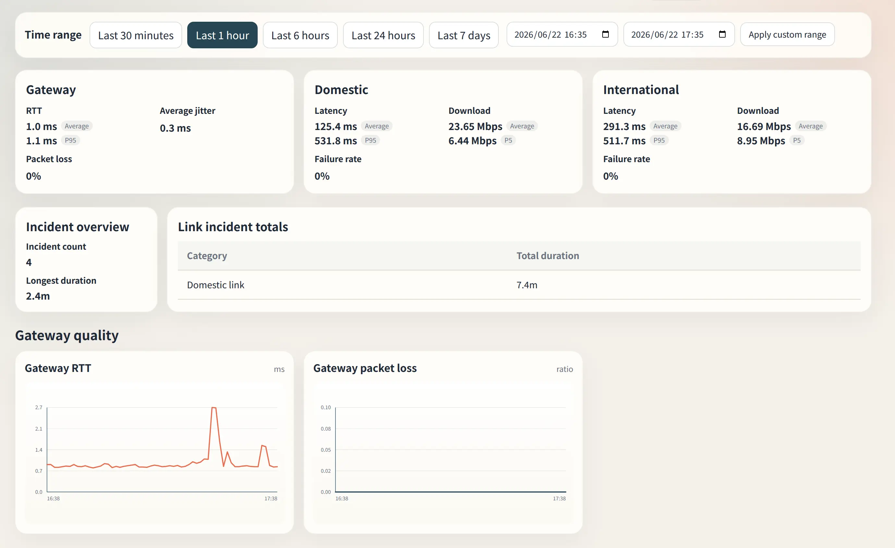
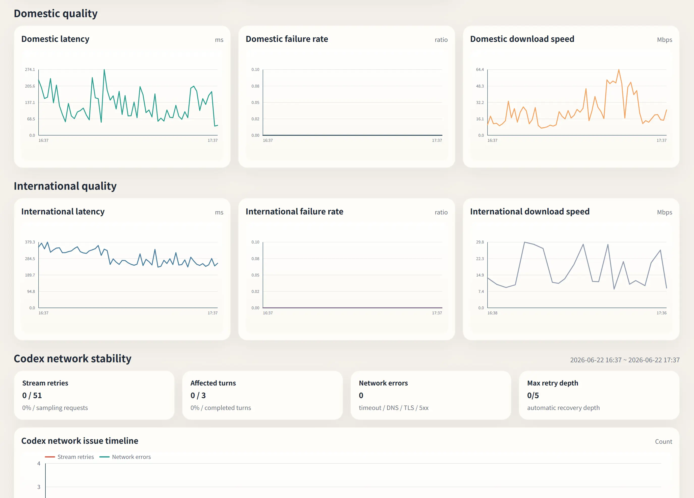

# netcheck

[简体中文](README.zh-CN.md)

`netcheck` is a long-running network quality monitor for understanding whether connectivity problems are local, domestic, international, or visible in AI coding tools such as Codex.

It focuses on a few practical questions:

- Is the path from this machine to the default gateway unstable?
- Are domestic links getting slower or failing more often?
- Are international links degraded enough to affect Codex, Claude, or other AI coding workflows?
- Is an issue just a short spike, or did it last long enough to matter?

Run it without arguments to start monitoring and open the web dashboard.

<table>
  <tr>
    <td width="50%"></td>
    <td width="50%"></td>
  </tr>
  <tr>
    <td align="center">English dashboard</td>
    <td align="center">Simplified Chinese dashboard</td>
  </tr>
</table>

## Use cases

- Office networks with intermittent latency, packet loss, or gateway issues.
- VPN or international routes that feel unstable but need historical evidence.
- Long-running network records that can be compared with meetings, locations, or time windows.
- AI coding workflows where Codex or Claude reliability depends on international connectivity.

## Features

- Zero-argument mode: monitor and web UI run together.
- Quiet by default; logs only state changes, background errors, and download probes.
- Local SQLite persistence so data survives terminal restarts.
- Web dashboard ranges for `30m / 1h / 6h / 24h / 7d` plus custom windows.
- Separate Codex stability panel for stream retries and network candidates, capped to the latest `24h`.
- Static HTML report export.
- One-command database reset.
- English by default, with Simplified Chinese support for CLI text, logs, reports, and the dashboard.

## Quick start

### Run directly

```bash
./netcheck
```

Startup does two things:

- Continuously samples network quality and writes data to SQLite.
- Starts the web UI, listening on `0.0.0.0:8765` by default.

If port `8765` is already in use, `netcheck` automatically switches to the next available port and prints both the actual listen address and a local access URL.

### Build from source

```bash
make build
./netcheck
```

### Build release binaries

```bash
make dist
```

Output files:

- `dist/netcheck-linux-amd64`
- `dist/netcheck-darwin-amd64`
- `dist/netcheck-darwin-arm64`

## Language

The default language is English.

Use Simplified Chinese from the CLI:

```bash
./netcheck --lang zh-CN
./netcheck ui --lang zh-CN
./netcheck report --since 24h --output report.html --lang zh-CN
```

You can also set the environment variable:

```bash
NETCHECK_LANG=zh-CN ./netcheck
```

The web dashboard includes an `EN / 中文` switch. In live UI mode, API requests include the selected language so table labels, empty states, and Codex errors refresh with the current language. Static reports embed the translation table and can switch language in the browser.

## What it monitors

### Gateway quality

- Pings the default gateway every second.
- Tracks RTT, jitter, and packet loss.

### Domestic quality

- Periodically checks domestic latency targets.
- Periodically runs small download probes.
- Tracks failure rate, average latency, and percentile-style summary values.

### International quality

- Periodically checks international latency targets.
- Default latency targets prefer `status.openai.com` and `status.claude.com`.
- Periodically runs international download probes to estimate usable throughput.

The goal is not to saturate bandwidth. The default probes are intended to detect practical degradation in day-to-day work, especially AI coding workflows that depend on stable international access.

### Codex experience

- Reads local Codex logs for the current user.
- Prefers current SQLite logs matching `~/.codex/logs*.sqlite` and keeps compatibility with the legacy `~/.codex/log/codex-tui.log`.
- Tracks sampling requests, automatic retries, timeout / DNS / TLS / 5xx-style network candidates, and completed turns.
- Uses modern `post sampling token usage` events as the sampling-request denominator when available, with a WebSocket/stream-close fallback for legacy logs.
- Shows a separate timeline so Codex retries can be compared with regular network probes.
- Keeps local tool errors, permission noise, session-recording issues, and unknown WARN/ERROR lines out of the main network timeline.

## Common commands

### Default mode: monitor + UI

```bash
./netcheck
```

### Monitor only

```bash
./netcheck monitor
```

### UI only

```bash
./netcheck ui
```

### Export a static report

```bash
./netcheck report --since 24h --output report.html
```

Custom time range:

```bash
./netcheck report --start 2026-04-10T09:00 --end 2026-04-10T18:00 --output report.html
```

### Write the default configuration

```bash
./netcheck init-config
```

### Clear local data

```bash
./netcheck clear
```

## Data locations

`netcheck` uses the current user's config directory by default.

Common Linux paths:

- Config: `~/.config/netcheck/config.json`
- Database: `~/.config/netcheck/netcheck.sqlite`

SQLite may also create:

- `netcheck.sqlite-wal`
- `netcheck.sqlite-shm`

## Configuration

The default configuration is ready to run. Export and edit it when you want to:

- Replace default domestic or international probe targets.
- Tune probe intervals or download sample sizes.
- Change degradation thresholds.

Write the default config and restart:

```bash
./netcheck init-config --force
./netcheck
```

## Dashboard

The dashboard shows:

- Gateway, domestic, and international summary cards.
- Latency, download, and failure-rate trends for each link.
- Incident count and longest incident duration for the selected range.
- Accumulated incident duration by link.
- Latest 10 incident events.
- A Codex stability panel for stream retries and network candidates.

### Detail views

<table>
  <tr>
    <td width="50%"></td>
    <td width="50%"></td>
  </tr>
  <tr>
    <td align="center">English detail view</td>
    <td align="center">Simplified Chinese detail view</td>
  </tr>
</table>

## License

Not specified yet.
