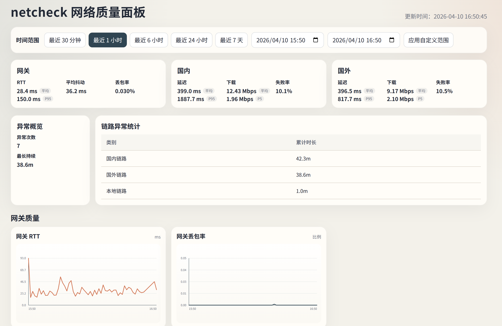

# netcheck

`netcheck` 是一个长期运行的网络质量监控工具，重点解决这几类问题：

- 电脑到默认网关是否抖动、丢包、延迟高
- 国内链路是否变慢、失败率是否上升
- 国外链路是否变慢，是否影响 `Codex / Claude` 这类 AI coding 使用体验
- 异常是偶发毛刺，还是持续性问题

默认直接运行即可开始监控，同时启动 Web 面板。



## 适合什么场景

- 办公网偶发卡顿，但很难回溯到底是哪一段出问题
- VPN 或国外链路时好时坏，想看趋势而不是只靠体感
- 需要长时间记录网络质量，方便和时间段、会议、办公地点做对比
- 想优先判断 AI coding 相关国外访问是否稳定

## 特性

- 无参数启动：监控和 UI 一起运行
- 平时静默，只有状态变化或测速时打印日志
- 本地持久化到 SQLite，数据不会因为终端关闭就丢失
- Web 面板支持最近 `30m / 1h / 6h / 24h / 7d` 和自定义时间范围
- Web 面板会异步展示本机 Codex 断流重试和网络错误时间轴，Codex 统计范围最多取近 `24h`
- 支持导出静态 HTML 报表
- 支持一键清空数据库重新开始

## 快速开始

### 直接运行

```bash
./netcheck
```

启动后会做两件事：

- 持续采样网络质量并写入数据库
- 启动 UI，默认监听地址是 `0.0.0.0:8765`

如果 `8765` 被占用，会自动切到其他可用端口，并在终端打印实际监听地址和本机访问地址。

### 从源码构建

```bash
make build
./netcheck
```

### 构建多平台二进制

```bash
make dist
```

输出目录：

- `dist/netcheck-linux-amd64`
- `dist/netcheck-darwin-amd64`
- `dist/netcheck-darwin-arm64`

## 默认监控内容

### 网关质量

- 每秒 `ping` 一次默认网关
- 统计 RTT、抖动、丢包率

### 国内质量

- 定期探测国内访问延迟
- 定期做小流量下载测速
- 统计失败率、平均值和分位值

### 国外质量

- 定期探测国外访问延迟
- 默认延迟目标优先选择 `status.openai.com` 和 `status.claude.com`
- 定期做国外下载测速，用于判断真实可用吞吐

这样做的重点不是“跑满带宽”，而是优先判断真实办公体验是否退化，尤其是 AI coding 相关的国外访问是否稳定。

### Codex 使用体验

- 读取当前用户本机 Codex 日志，优先使用正在更新的 `~/.codex/logs*.sqlite`，兼容旧版 `~/.codex/log/codex-tui.log`
- 重点统计模型采样请求、自动重试、timeout / DNS / TLS / 5xx 等网络错误；新版 Codex 日志以 `post sampling token usage` 作为采样请求分母，旧版日志回退到 WebSocket/stream close 打点
- 在 Web 面板中生成独立时间轴，便于和上方网络连接测试时间轴对齐
- 工具调用、权限、会话记录和未知 WARN/ERROR 不混入网络异常时间轴
- 当 UI 选择范围超过 `24h` 时，Codex 日志统计自动收敛到最近 `24h`

## 常用命令

### 默认模式：监控 + UI

```bash
./netcheck
```

### 仅运行监控

```bash
./netcheck monitor
```

### 仅启动 UI

```bash
./netcheck ui
```

### 导出静态报表

```bash
./netcheck report --since 24h --output report.html
```

也支持自定义时间范围：

```bash
./netcheck report --start 2026-04-10T09:00 --end 2026-04-10T18:00 --output report.html
```

### 导出默认配置

```bash
./netcheck init-config
```

### 清空数据库

```bash
./netcheck clear
```

## 数据存放位置

默认使用系统用户配置目录。

Linux 常见位置：

- 配置：`~/.config/netcheck/config.json`
- 数据库：`~/.config/netcheck/netcheck.sqlite`

运行中的 SQLite 还可能生成：

- `netcheck.sqlite-wal`
- `netcheck.sqlite-shm`

## 配置说明

默认配置已经可以直接使用。只有在这些情况下才建议导出配置并修改：

- 想替换默认的国内/国外探测目标
- 想调整测速频率或下载采样大小
- 想修改异常阈值

导出后重新启动程序即可生效：

```bash
./netcheck init-config --force
./netcheck
```

## 面板能看到什么

- 网关、国内、国外三张汇总卡片
- 各链路的延迟、下载、失败率趋势图
- 当前时间范围内的异常次数和最长异常时长
- 三条链路各自的异常累计时长
- 最近 10 条异常事件时间轴

## 适用建议

- 如果你更关注办公室本地网络稳定性，重点看网关质量
- 如果你更关注国内 SaaS、会议、文档访问，重点看国内质量
- 如果你主要用 `Codex / Claude / 其他 AI coding`，重点看国外质量

## License

暂未提供。
