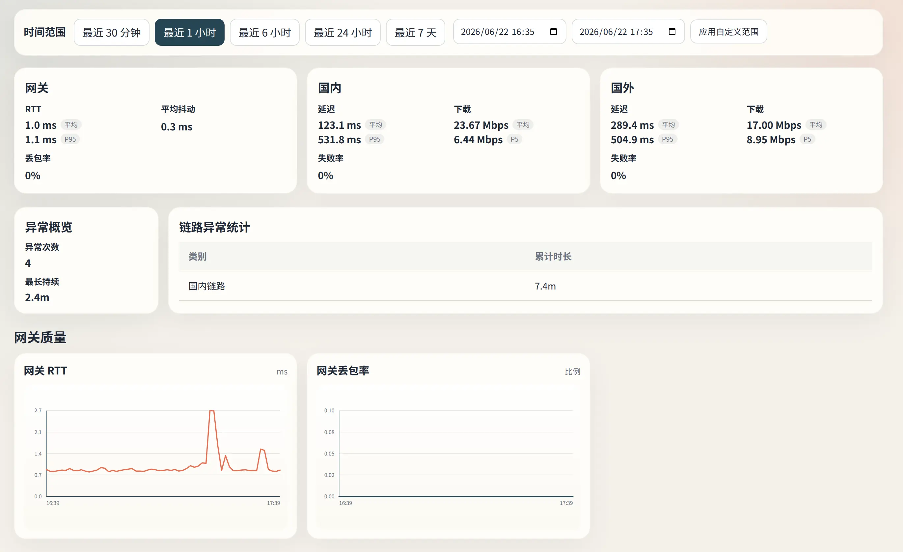
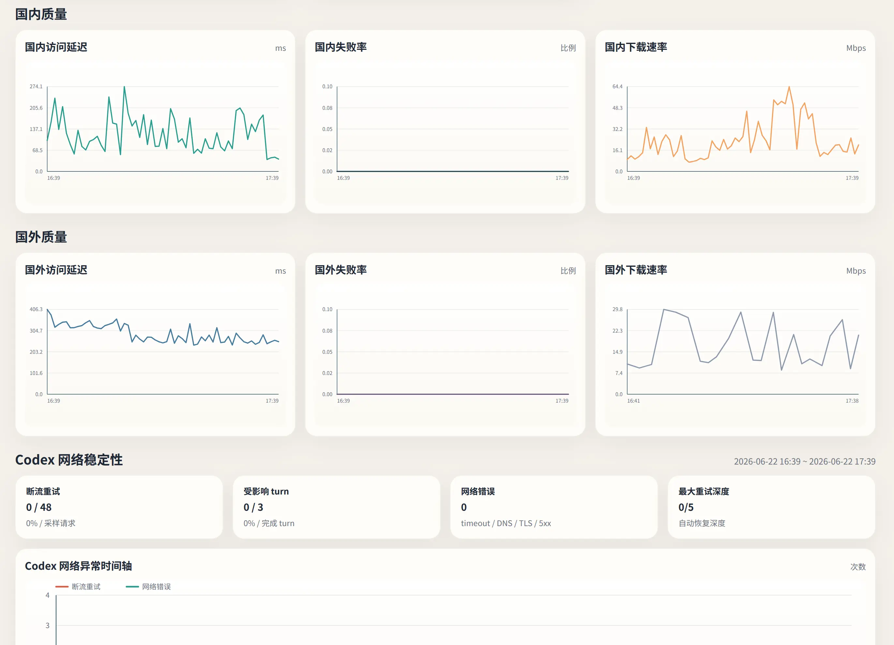

# netcheck

[English](README.md)

`netcheck` 是给 vibe coding 开发者使用的网络质量面板，用来判断 Codex 变慢到底是模型、客户端，还是底层网络链路造成的。

网络波动会直接放大 Codex 的交互耗时。把 Codex 开到 fast，不如先让网络质量变好；同样一次 vibe coding 任务，在网络差和网络正常的情况下，整体耗时可能相差一倍。`netcheck` 一边监控本机、国内、国外链路波动，一边直接读取 Codex 请求结果，让网页面板给出明确的网络质量评价，而不是只能靠“感觉慢”来判断。

<table>
  <tr>
    <td width="50%"></td>
    <td width="50%"></td>
  </tr>
  <tr>
    <td align="center">统计概览</td>
    <td align="center">详细指标和 Codex 时间轴</td>
  </tr>
</table>

## 核心亮点

- **网络与 Codex 对齐到同一条时间轴。** 把网络探针和 Codex 的真实请求结果（断流重试、受影响 turn、token 用量、轮次耗时）放在同一时间线上，从而区分“模型本身慢”和“网络让同一段工作流变慢”。
- **单文件二进制，运行零依赖。** 整个网页 UI（HTML、原生 JavaScript、手绘 SVG 图表）通过 `go:embed` 编译进二进制——无 CDN、无前端框架、无图表库。存储采用纯 Go 实现的 SQLite（`modernc.org/sqlite`，无需 CGO），可静态交叉编译。一个文件丢上机器就能跑。
- **智能 Codex 日志解析。** 自动在 Codex 文本日志（`~/.codex/log/codex-tui.log`）和 Codex SQLite 日志两种来源中选择**最近更新**的那个；大文本日志从文件尾部反向读取、窗口倍增，从不全量扫描整个文件。
- **三层健康判定 + 防抖状态机。** 本机 / 国内 / 国外三层，在滑动窗口内统计 P95、抖动、失败率；降级状态需连续多次劣化才进入、连续多次恢复才解除，且未结束的降级事件可跨进程重启续接。
- **开箱即用的鲁棒性。** 自动发现默认网关；`8765` 端口被占用时自动回退到下一个可用端口；内置中英双语（English / 简体中文）UI 和 CLI。

## 快速开始

从源码构建（需要 Go 1.25+）：

```bash
make build
./netcheck
```

或使用 Go 工具链安装：

```bash
go install github.com/Zzzia/netcheck/cmd/netcheck@latest
```

该命令会把 `netcheck` 二进制安装到 `$(go env GOPATH)/bin`（通常是 `~/go/bin`）。确认该目录已加入 `PATH` 后，即可在任意位置启动：

```bash
netcheck
```

打开终端输出的本地 URL。默认情况下，网页面板监听 `0.0.0.0:8765`；如果端口被占用，`netcheck` 会自动切到下一个可用端口，并打印实际访问地址。

## 面板内容

- 网关 RTT、抖动和丢包率。
- 国内、国外链路的延迟、下载速度和失败率。
- 当前时间范围内的异常持续时间和最近网络事件。
- Codex 断流重试、受影响 turn、网络错误候选和最大重试深度。
- 对齐网络探针和 Codex 请求时间轴，帮助区分“模型本身慢”和“网络让同一段 Codex 工作流变慢”。

## 命令

不带参数运行 `netcheck` 会同时启动监控和网页面板。如需更细控制，可使用子命令：

| 命令 | 作用 |
| --- | --- |
| `netcheck` | 同时启动监控和网页面板（默认）。 |
| `netcheck monitor` | 只运行后台探针，把采样写入存储。 |
| `netcheck ui` | 只基于已有数据提供网页面板。 |
| `netcheck report` | 针对某个时间范围生成一次性报告。 |
| `netcheck clear` | 删除本地 SQLite 数据库及其 WAL/SHM 文件。 |
| `netcheck init-config` | 生成默认配置文件。 |

常用参数：`--lang en|zh-CN`（全局）、`--config <路径>`、`--addr <host:port>`（用于 `ui`）、`--since` / `--start` / `--end` / `--output`（用于 `report`）。UI/CLI 语言也可以通过环境变量 `NETCHECK_LANG` 设置。

## 配置

`netcheck` 使用合理的默认值，无需配置即可运行。如需自定义采样间隔、降级阈值、探测目标和告警，可生成并编辑 JSON 配置：

```bash
./netcheck init-config
```

默认配置文件位于 `<用户配置目录>/netcheck/config.json`。给任意命令传 `--config <路径>` 即可使用其他配置文件。

## 数据与隐私

- 探测采样和降级事件以 SQLite 形式存储在本地 `<用户配置目录>/netcheck/netcheck.sqlite`（用 `netcheck clear` 清除）。
- `~/.codex/` 下的 Codex 日志仅以**只读**方式读取，绝不写入或上传到任何地方，所有分析都在本地完成。

## 平台支持

已在 **Linux** 和 **macOS** 上支持并测试。默认网关发现和 `ping` 调用均为 Unix 风格，**暂不支持 Windows**。

## License

基于 [MIT License](LICENSE) 开源。
